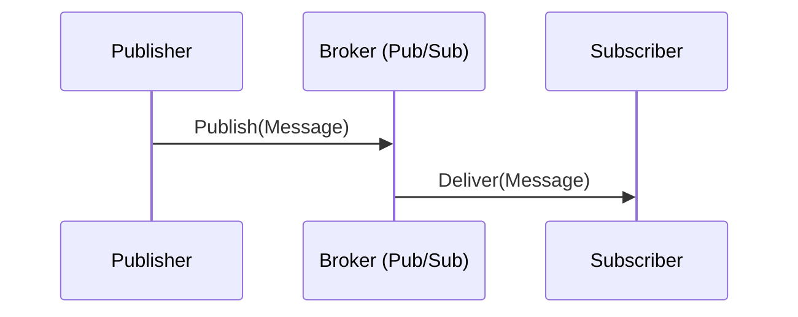

# Choosing the Message Broker

Goroutines are both simple and powerful. They have served us well so far in introducing some asynchronous behaviors.

But they are still a naive solution.
**We keep everything in memory, so we can easily lose the messages if the service is restarted.**
We also had to implement our own logic for handling errors and retrying.

The next step is choosing a *message broker*, known also as Pub/Sub or queue.

As the name suggests, most Pub/Subs expose two features: publishing and subscribing.
The atomic data unit that you publish and subscribe to is a *message*.
Pub/Subs vary in terms of their supported features and approach, but this basic idea is common to all of them.

In essence, a message broker is a middleman between publishers and subscribers.

### The right message broker for YOU

Let's start with one assumption: There's no "best" general solution. Like choosing a database engine,
you should consider what makes sense for you, your team, and your project.

Some of the popular brokers are:

* [Apache Kafka](https://kafka.apache.org)
* [RabbitMQ](https://www.rabbitmq.com)
* Cloud Pub/Subs, like [AWS SNS/SQS](https://aws.amazon.com/sns/) or [Google Cloud Pub/Sub](https://cloud.google.com/pubsub)
* [Redis Streams](https://redis.io/docs/latest/develop/data-types/streams/)
* [NATS](https://nats.io)

Some cloud providers offer managed solutions, which can be a good choice if you don't want to manage the infrastructure yourself.

Message brokers, just like databases, are critical infrastructure components.
You need to consider factors like availability, maintenance, backups, and security.
When your messaging infrastructure goes offline, your services won't work properly.

If you don't have extreme requirements for performance and you don't want to add extra infrastructure,
you can start with a message broker implemented on top of a database like PostgreSQL or MySQL.
This is [supported out of the box](https://watermill.io/pubsubs/sql/) by some libraries, including Watermill.

## Pub/Subs in this training

In the following exercises, we'll use Redis Streams Pub/Sub for its simple configuration.
We chose Redis because it's quite lightweight compared to other solutions,
so it's a natural choice for local development and verifying your solutions.

Keep in mind that Redis might or might not be a good fit for your application. 
Choosing the right message broker is a broad topic and beyond the scope of this training.
Please do your own research!
