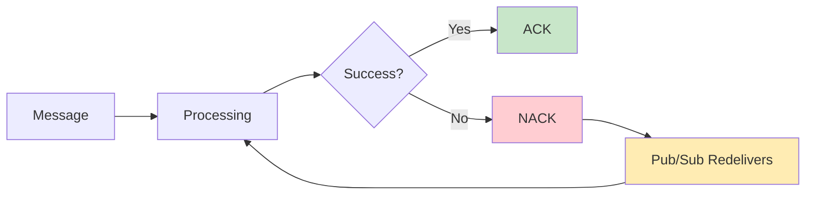

# Negative Ack

As with handling HTTP requests, processing a message can fail for many reasons, such as the message being invalid or the database being down.

In contrast to synchronous calls, we can't just return the error.
The client doesn't wait for a response at this point.

The key to handling errors is not losing the message.
Usually, you don't want to call `Ack()` for a message that failed to process.
Instead, there's a `Nack()` method.
It sends a "negative acknowledgement" that tells the broker to return the message back to the queue.

What happens next depends on the Pub/Sub implementation.
Most often, the message is delivered again, either immediately or after a delay.



```go
for msg := range messages {
	orderID := string(msg.Payload)
	fmt.Println("New order placed with ID:", orderID)
	
	err := SaveToDatabase(orderID)
	if err != nil {
		fmt.Println("Error saving to database:", err)
		msg.Nack()
		continue
	}
	
	msg.Ack()
}
```

We'll look into different strategies for error handling in future modules.
For now, returning the message back to the queue is good enough.
It will be redelivered and processed again, which sometimes is all we need.

## Exercise

Exercise path: ./03-message-broker/04-nack/main.go

We're using a smoke sensor that publishes messages on a Pub/Sub topic.
The message's payload can be one of two values:

* `0` - no smoke detected
* `1` - smoke detected

Based on this, we want to turn the alarm on or off using the provided `AlarmClient`. 

Sometimes, changing the alarm state can fail (a non-nil error is returned).
We can't risk not raising the alarm when smoke is detected.
In this case, we want to retry the processing.

**Fill in the missing logic in `ConsumeMessages`.**

Turn the alarm on or off, depending on the value in the payload.
Then check the error and call `Ack()` or `Nack()` on the message.

The `0` and `1` values are strings — you don't need to convert them to integers.

{{tip}}

You can see the tests for this exercise.

They use the [`GoChannel` Pub/Sub](https://watermill.io/pubsubs/gochannel/).
It's an in-memory Pub/Sub using Go channels, ideal for testing.

{{endtip}}
