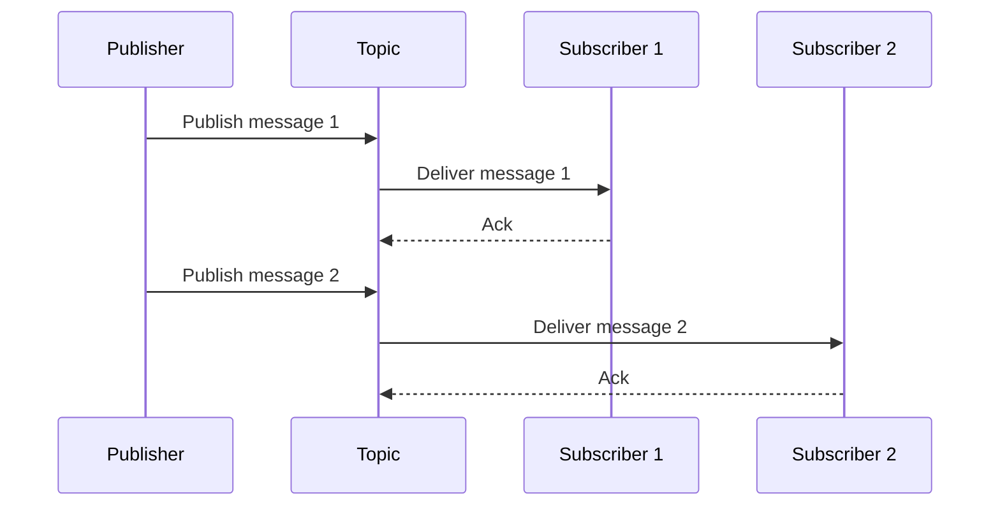

# Consumer Groups

Publishing messages is often straightforward: There's a message and a topic to which it's published.
Deciding who should receive the message is more complex.

So far, we've dealt with a single subscriber.
Redis Streams make this easy because you can pass the topic name and receive any future messages.
However, this is far from a production-ready setup.

We'll look at more advanced concepts in the following modules. For now, consider two limitations:

1. We may want to run a second replica of the same application. If we do, both instances receive the same messages, so they are processed twice.
2. If our service goes down, it loses all messages sent before it comes back up.
   This doesn't need to be a serious outage: A simple restart after deploying a new version is enough to cause this.

A *consumer group* is a concept intended to deal with these issues and decide which subscribers should receive which messages.

Most Pub/Subs have some way to achieve this, but not all call it a *consumer group*.
Some brokers use a different model, like creating a *subscription* or *queue*, but the core idea is the same.

In the case of Redis Streams, a consumer group is a string assigned to the subscriber.
All subscribers using the same value are part of the same group.

**An independent "copy" of each message is delivered to only one subscriber within the group.**
Acknowledgments are independent for each group.
In other words, the message is delivered to the group as a whole, not to every individual subscriber.

Very often, subscribers within the same group receive messages in a round-robin fashion, which distributes the load evenly.




Redis remembers the last message delivered to each group.
If a subscriber restarts, it will receive the messages sent during the time it was down
(unless there were other subscribers in the same group that already processed them).

To set a consumer group for the Redis Streams subscriber, pass the chosen name as the `ConsumerGroup` config option.

```go
subscriber, err := redisstream.NewSubscriber(
	redisstream.SubscriberConfig{
		Client: redisClient, 
		ConsumerGroup: "my_consumer_group",
	},
	logger,
)
```

{{tip}}

What do consumer groups look like in other Pub/Subs?

- Kafka uses *consumer groups*, like Redis.
- RabbitMQ uses *queues*.
- Google Cloud Pub/Sub and NATS use *subscriptions*.
- AWS SNS uses SQS queues.

{{endtip}}

## Exercise

Exercise path: ./03-message-broker/05-consumer-groups/main.go

The `Subscribe` function sets up two subscribers for the same topic: `orders-placed`.
With each new order, the code appends a row to a spreadsheet and sends a notification to the user.

Update the exercise code so that each subscriber is assigned to a different consumer group.
Call the groups `notifications` and `spreadsheets`.
