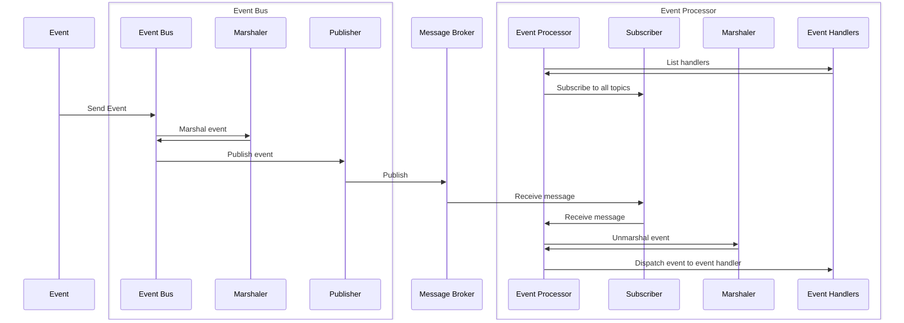

# Using the Event Bus

Perhaps you've noticed that our current implementation
of event handling has significant duplication related to event marshaling and unmarshaling.

While this isn't an issue for small projects, larger projects require a consistent approach.
This reduces the risk of bugs and simplifies the implementation of new features.
Moreover, it decreases cognitive load for developers — you no longer need to worry about the technical details
and can focus on implementing the business logic.

Since this is a training about building event-driven applications, not about building event buses (which you typically don't implement when joining an event-driven project), we won't implement our own event bus.
We have many more relevant topics to cover in the future modules.
To save time, we'll use the Event Bus and Event Processor implementation from [Watermill's CQRS component](https://watermill.io/docs/cqrs/).
Even if you don't plan to use Watermill in your future projects (though we highly recommend it!),
this module will give you a good idea of how to design your own event bus implementation.

{{tip}}

CQRS is usually associated with event-driven or asynchronous architectures, but it's not a requirement.
This pattern also brings great value in traditional, synchronous architectures.
If you want to learn more about CQRS:
- [How to use basic CQRS in Go](https://threedots.tech/post/basic-cqrs-in-go/)
* [Killing the legacy and other CQRS stories [video]](https://www.youtube.com/watch?v=GdLu7FQBrdk)

{{endtip}}

### Using the CQRS Component

We need three building blocks from the CQRS component:
- **EventBus**: a component that allows publishing events
- **EventHandler**: the part you implement to handle events
- **EventProcessor**: the part that receives events emitted by the EventBus and passes them to the appropriate EventHandler

This is how it looks at a high level (don't be afraid if you don't see the big picture yet — we'll cover each part in detail):



We recommend that you go back to this diagram after learning about each module to see how it fits the big picture.

None of these building blocks are exclusive to Watermill or Go: They're general software engineering concepts used in different programming languages.

### EventBus

Let's start by getting familiar with EventBus.
The responsibility of the event bus is to hide all the complexity of publishing events behind a simple interface:

```go
// Publish sends an event to the event bus.
func (c EventBus) Publish(ctx context.Context, event any) error {
```

You don't need to worry about how to serialize your event, how to send it to a message broker, or which topic to use, etc.
The EventBus does all that for you.

```go
err := h.eventBus.Publish(ctx, entities.TicketBookingConfirmed{
	Header: entities.NewMessageHeader(),
	
	TicketID:      ticket.TicketID,
	Price:         ticket.Price,
	CustomerEmail: ticket.CustomerEmail,
})
```

To construct Watermill's implementation of EventBus, you need to provide a publisher and the event bus configuration:

```go
func NewEventBusWithConfig(publisher message.Publisher, config EventBusConfig) (*EventBus, error) {
```

```go
type EventBusConfig struct {
	// GeneratePublishTopic is used to generate a topic name for the publishing event.
	GeneratePublishTopic GenerateEventPublishTopicFn

	// OnPublish is called before sending the event.
	// The *message.Message can be modified.
	//
	// This option is not required.
	OnPublish OnEventSendFn

	// The Marshaler is used to marshal and unmarshal events.
	// It is required.
	Marshaler CommandEventMarshaler

	// Logger instance used to log.
	// If not provided, watermill.NopLogger is used.
	Logger watermill.LoggerAdapter
}
```

`GeneratePublishTopic` decides to which topic an event will be published.
If you want to use a single topic, it can be a function that returns the same topic for every event.
Otherwise, you can use the `params` argument to generate the topic name based on the incoming event.

```go
cqrs.EventBusConfig{
	GeneratePublishTopic: func(params cqrs.GenerateEventPublishTopicParams) (string, error) {
		return "events", nil
	},
}
```

The `Marshaler` is responsible for serializing and deserializing events.

```go
type CommandEventMarshaler interface {
	// Marshal marshals Command or Event to Watermill's message.
	Marshal(v any) (*message.Message, error)

	// Unmarshal unmarshals Watermill's message to v Command or Event.
	Unmarshal(msg *message.Message, v any) (err error)

	// Name returns the name of Command or Event.
	// Name is used to determine that the received command or event is an event that we want to handle.
	Name(v any) string

	// NameFromMessage returns the name of Command or Event from Watermill's message (generated by Marshal).
	//
	// When we have Command or Event marshaled to Watermill's message,
	// we should use NameFromMessage instead of Name to avoid unnecessary unmarshaling.
	NameFromMessage(msg *message.Message) string
}
```

You can provide your own implementation
or choose a default one for [JSON](https://github.com/ThreeDotsLabs/watermill/blob/master/components/cqrs/marshaler_json.go#L10)
or [Protobuf](https://github.com/ThreeDotsLabs/watermill/blob/master/components/cqrs/marshaler_protobuf.go#L14).
You can also customize an existing one by struct composition.

## Exercise

Exercise path: ./09-cqrs-events/01-event-bus/main.go

Let's practice using EventBus.

Implement the `NewEventBus` function.
It should return `*cqrs.EventBus` with the default JSON marshaler (`cqrs.JSONMarshaler{}`) and topic
generator that returns `params.EventName`, so the event name is used as the topic name.

In the test, we'll publish `main.DocumentPrinted` and `main.DocumentDownloaded`.
By default, the JSON Marshaler generates event names based on the struct type.
We want to use the default settings, so the topics should be `main.DocumentPrinted` and `main.DocumentDownloaded`, respectively.
