# The Outbox Pattern

To handle bookings without Dead Nation, we need to be sure that we can replace their functionality on our side.
We need to find a way to send requests to Dead Nation during the transition period and keep the ticket limits.
After we finish the transition period, and we ensure that it all works, we'll be able to terminate our contract with Dead Nation.

The most important constraint is not allowing overbooking.
In practice, this should just mean that we have a table in which we count sold tickets and ensure within an SQL transaction that we don't sell more tickets than available.
After checking overbooking, we call Dead Nation and voilà.
Nothing complicated, right?
Well, it's not that easy.

Remember how Dead Nation is sometimes down while we handle a big show?
They can't handle such high traffic.
If they go down, nobody can buy a ticket.
**So, we can't rely on synchronous calls to them.**

We're the only company that can sell tickets to all our shows, so we don't need a response from Dead Nation at the time of booking.
If we're sure about the number of tickets left, we can sell them, and emit a `BookingMade` event.
Later, in reaction to this event, we can trigger the Dead Nation call.

This is a good idea, but it's not the end of the challanges.
Do you see a potential issue here?

Let's look at this scenario:

Let's see what can happen when the service dies (or loses its network connection).

The transaction is committed, but we don't emit the `BookingMade` event.
So we have a booking in the database, but the event wasn't published and won't ever be processed.

Maybe we could emit the event before committing the transaction?
Let's try:

```mermaid
sequenceDiagram
  participant Service
  participant Database
  participant PubSub

  
  Service->>Database: Start transaction
  activate Database

  Service->>Database: Check places left
  Database->>Service: 

  Service->>Database: Store ticket booking

  Service->>PubSub: Emit BookingMade emitted

  Note over Service: Service dies 💥

  Service-xDatabase: Data is not committed
  deactivate Database
```

We emit the event, but we don't commit the transaction.
It's likely that the person receives the ticket.
**However, we may end up with overbooking: two people getting the same seat.**

Now you can see one of the most common problems with event-driven systems.
At lower scale and in systems where data consistency isn't that important, it's not an issue.
However, with bigger systems — especially ones with high data consistency requirements — this may lead to issues that are hard to debug.

In the case of our ticketing system, it's a serious problem.
We've seen such a situation at a KISS concert: two people had the same place, and in the middle of the show, they needed 
to get out of the hall and resolve the problem.
Wouldn't you be angry if that happened to you?

{{tip}}

Similar problems can happen in other scenarios, even not using messages.

In the diagram above, replace event publishing with an HTTP call to an external service, and you'll end up with the same dilemma.

{{endtip}}

### The Outbox Pattern

We can solve this problem with a pattern called `The Outbox`.
The idea is simple: **We need to store events in the same transaction as data in the same database, and later forward them to the Pub/Sub.**

Wait, store events in the same database?
Correct! We'll store our events in PostgreSQL and forward them to the Pub/Sub later.

(We'll use the same service to forward the events, but it could be also a separate one.)

Now, it's not a problem if the service dies during the transaction: The event won't be committed together with the data.

What if the forwarder dies in the middle of publishing events?

As you can see, the event is republished.
We may end up with the same event published multiple times on the Pub/Sub.
Is it a problem?
It shouldn't be, because our handlers {{exerciseLink "are idempotent" "10-at-least-once-delivery" "05-idempotent-event-handlers"}}!
