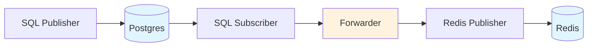

# Forwarding messages

The key part of the outbox pattern is forwarding messages from the database to the Pub/Sub system.
In our case, it's Postgres to Redis.



To forward messages, we'll use Watermill's `Forwarder`.
It's a pretty simple component that subscribes to a topic using the given subscriber.
Once running, it takes all incoming messages on that topic and publishes them using the given publisher.

(The publisher's topic is dynamic — we'll look into it in the next exercise.)

Here's how you create a forwarder:

```go
fwd, err := forwarder.NewForwarder(
    subscriber,
    publisher,
    logger,
    forwarder.Config{
        ForwarderTopic: topic,
    },
)
```

Then, you need to run it, similar to how you would run a Router:

```go
go func() {
    err := fwd.Run(context.Background())
    if err != nil {
        panic(err)
    }
}()

<-fwd.Running()
```

{{tip}}

If you don't want to depend on Watermill in your projects, you can implement your own version of the `Forwarder` component.
It makes sense if you have more custom needs.

The entire code of the Forwarder component is in the Watermill's [repository](https://github.com/ThreeDotsLabs/watermill/tree/master/components/forwarder).

We recommend starting with Watermill's components.
They are modular and can be easily replaced with a custom implementation.

{{endtip}}

## Exercise

Exercise path: ./11-outbox/07-forwarding-with-outbox/main.go

**Implement the `RunForwarder` function:**

```go
func RunForwarder(
	db *sqlx.DB,
	rdb *redis.Client,
	outboxTopic string,
	logger watermill.LoggerAdapter,
) error {
```

1. Create a new forwarder with `forwarder.NewForwarder`. Pass the provided Postgres Subscriber and Redis Publisher.

Set the `ForwarderTopic` config field to the `outboxTopic` variable.

2. Run the forwarder.

The function should be non-blocking, but it should wait for the forwarder to start.

{{tip}}

The code includes the `SubscribeInitialize` call, which creates the SQL tables for the forwarder to use.

{{endtip}}
