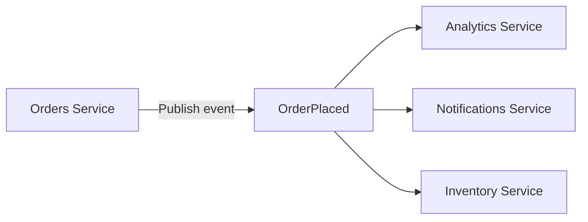
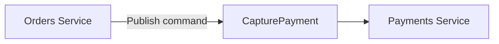

# Commands vs Events

In {{exerciseLink "the Events module" "05-events" "01-events"}}, we said that **you should not use passive-aggressive
events.**
You should use events to model things that happened, represent them as immutable facts, and not care about how subscribers react to them.

However, what if you want to model something that *should* happen, and you care about a specific action to be performed?
**For example, suppose you want to send a notification to a user.**
You want to ensure that this operation is eventually executed, but you don't want to wait for the result synchronously.
Commands are perfect for such scenarios.

{{tip}}

Like events, commands are not intended to return any result to the emitter and are meant to be processed asynchronously.
What if you expect a specific action to be performed, but you want to know the result and do it synchronously?
This is a good case for the good old RPC or HTTP call.

{{endtip}}

## Commands

Commands are perfect for scenarios where you want to do a specific operation asynchronously.
With events, you emit the event and don't care what happens.
In the case of commands, you expect some reaction.

Usually, unlike events, commands are consumed by only one consumer.

It may seem like the difference between an event and a command is in the name.
That's mostly true.
But in bigger systems, it's a great help to understand how everything works together and what the expected behaviors are.
Whether you use an event or a command is part of the contract, and it helps you understand the system better.

For commands, the message broker setup may be a bit different — you don't want to have many consumers for one command.
You may also want to use different monitoring strategies for commands and events.

{{tip}}

You may have heard about Command Query Responsibility Segregation (CQRS).
One of the most common misunderstandings about CQRS is that commands need to be handled asynchronously.
That's not true!

For the sake of the training, we use commands as asynchronous messages, but that's not required.
The only requirement of CQRS is that you should separate writing operations from reading operations in your code.

Synchronous commands are out of the scope of this training.
You can read about that approach in our [Introducing basic CQRS by refactoring a Go project](https://threedots.tech/post/basic-cqrs-in-go/) article.

{{endtip}}

**Watermill [provides](https://watermill.io/docs/cqrs/) `CommandBus` and `CommandProcessor` APIs, which work similarly to `EventBus` and `EventProcessor`.**
Most of the API is a mirror of the event APIs.

## Exercise

Exercise path: ./12-cqrs-commands/01-command-vs-event/main.go

1. Replace the passive--aggressive `NotificationShouldBeSent` event with the `SendNotification` command.
2. Replace `cqrs.EventProcessor` with `cqrs.CommandProcessor`.

Commands are published to the `commands` topic.
