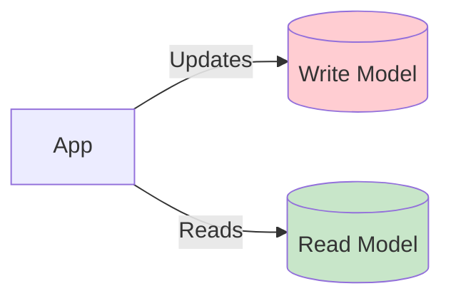

# Read Models

{{background}}

Like it usually happens, during migrating out of Dead Nation we forgot about one thing.

**The operations team had a very nice dashboard on the Dead Nation website.**
They've been using it as the central place for doing their job.
It gave them an overview on all bookings, tickets and receipts.

The exact list of information that they used was:

- When the booking has been created,
- The list of tickets for the booking, with:
    - Price,
    - Customer email,
    - When the ticket has been confirmed,
    - When the ticket has been refunded (if it has been refunded),
    - When the ticket has been printed,
    - File name of the printed ticket (so they can download it),
    - When the receipt has been issued,
    - The receipt number.

This is a blocker before getting rid of Dead Nation.
**We need to provide that data to operations via our API.**

{{endbackground}}

If you take a look on the list requested by the Ops Team, you can tell we don't store all of it in the database.
One option is adding all this information to the tables we already have.
But there's also an alternative approach: the _read model_ pattern.

In this pattern, we store data in a format that is optimized for fast reading (for example, via API or by some background processes).
The format should be close to the desired output format, and it shouldn't require any transformations.
In our case, we could store it in the database as a JSON with the same fields as what we want to return from the API.

**In simple systems, it's good enough to just query all the data from a single database, joining all necessary tables.**
In the project we work on, it would be completely fine.
But let's do some over-engineering on purpose to practice this pattern.

### When to use read models?

There are multiple scenarios, when read models are a good choice.

**Read models are a great choice when you work with data with high read throughput.**
You can build a read model that is optimized for reading and scale your database horizontally.
It's common to store read models in a different kind of database than your other data.
It's called [Polyglot persistence](https://martinfowler.com/bliki/PolyglotPersistence.html)

{{tip}}

In our case, we could use a NoSQL database such as Elasticsearch, to store the read models.
It could provide nice search and filtering capabilities for the Ops Team.

For simplicity, we'll stick to PostgreSQL for now.
But keep in mind it's something to consider in a real system.

{{endtip}}

**Read models also help to give teams more autonomy on how they store data.**
Sometimes, some teams have different requirements for the format of stored data.
With read models, they can use a format that's optimized for their use case without affecting other teams.

**You can also use read models, when you want to migrate out of a legacy system and build a new model based on
events.**
Often, legacy systems depend on large data models, which are hard to maintain when they split into many smaller services.
Instead, you can emit events from the legacy system and build a new read model based on them in a decoupled way.

Another scenario, when Read Models can help you, is a situation when some read use cases (for example, API endpoints, but not only)
have very high resiliency requirements, and the data is now spread across multiple data stores.
With a read model, you can aggregate all the required data in one place.
It simplifies reading operations a lot, so it's easier to ensure the stability of this part of infrastructure.

Last, but not least: you can use read models as a cache.
Usually one of the biggest problems with building a cache is the invalidation policy.
For how long it should be cached? When should it be invalidated?
You can use a read model as an alternative, which is updated by events and is always up to date.

### Read models vs write models and the source of truth

To understand read models properly, it's important to grasp the difference between a _read model_ and _write model_.

**_Write model_ is strongly consistent and has always the latest available data.
This is the data model we update and which guarantees domain invariants.**
Your write model should be the _single source of truth_ for your application.
If you want to update the booking, you update the `bookings` table.
If you want to check how many tickets are available, you check the `tickets` table.
**Those tables are your _write models_.**

A typical monolith non-event-driven application has just write models.
It's part of the reason why they're so hard to scale and maintain.
It's challenging to solve all problems with a single model.

**Having a _single source of truth_ simplifies your system logic a lot.**
You don't need to think about where you need to update the data.
There's a single place you need to update, and the downstream consumers need to adapt to the changes.

### Cost of using 

Each of our decisions has tradeoffs. It's the same with read models.

The first one is the cost of extra used storage.
We need to duplicate some data in multiple databases.
On the other hand, that's what we already do in other contexts. 
RAID, High-Availability, horizontal scaling - it's all about duplicating data. 

Another cost is making migrations harder.
Now, instead of updating one model, we need to update many of them.
It gives you one advantage, though — you don't need to migrate all models at once.
Some of them may be exposed publicly, so you may not want to change them.
With a single model, it's hard to do. Read models give you this choice.

The last complexity is that you need to update multiple places in case of data bugs.
Like with migrations, it's not enough to run an SQL update on a single database.
You need to emit events for all read models and update them (or run multiple SQL updates on multiple databases, but we don't recommend it).
