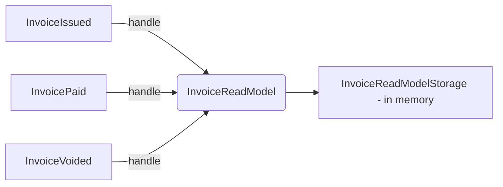

# Read Models

Building read models is one of those techniques that are easy to learn, but hard to master.
Here's some arcane knowledge to help you do it properly.

### Implementation details

**To build a read model:**

1. Consume all events with the data you need.
2. Store this data in a format optimized for reading in your use case.

While building a read model, you should keep the logic as simple as possible.

Let's consider you want to build a read model of an invoice.
**Your read model shouldn't decide if the invoice has been paid based on the paid amount.**
This logic should be in a single place in your system, in the write model.

The read model should just store the information that the invoice has been fully paid.
You could use a flag like `FullyPaid` in the `InvoicePaymentReceived` event.

{{tip}}

The read model shouldn't contain business logic or validations.

You built it based on events, which are facts that happened.

If you receive information that a ticket has been printed, you shouldn't check if there are enough spots available.
**The write model should handle this logic.**

The only exception is when you build a read model which responsibility is to validate some data.

Still, it's fine to do sanity checks (so you can avoid propagating invalid data further).
If you detect an event without some important data, you can reject it and raise some alert to investigate it.
We'll cover it a bit later in the training.

{{endtip}}

{{tip}}

**Keep in mind that read models built from events are eventually consistent.
They're not updated in real time, but with some delay.**

It's usually a sub-second delay that the user won't notice.
It's a tradeoff to make our system more scalable and resilient.

Because of this, using asynchronous read models may be not a purely technical decision.
It could have a huge impact on how the business works.
You need to discuss it with your stakeholders.

One tip on how to ask about it: don't simply ask if the data needs to be consistent — the business will always say that it needs to be.
Instead, ask if booking a ticket should fail if we were unable to update the operations team's dashboard,
or is it better to update it with a small delay instead.
It shows how important it is to ask questions the right way and explain the tradeoffs.

{{endtip}}

Normally, it's not a good idea to map complex database models directly to the API models.
It's the source of very tight coupling.
It makes it hard to evolve the database model because all the changes get propagated to the API.
(Even if they're not intended to be returned.)
And vice versa — not all data from the API should be stored in the database.

{{tip}}

You can read about this problem in depth in our [When to avoid DRY in Go](https://threedots.tech/post/things-to-know-about-dry/) article.

{{endtip}}

But read models are different — they're used **just** for reading.
They don't keep track of any invariants or the domain code.
We can return the stored models directly from the API with no impact on the rest of the application.

This shortcut simplifies our code and makes it extremely performant.
You do one database lookup and return the data without any post-processing or joins.
It's also very easy to scale it horizontally and geographically if needed.

This is also a great and less complex alternative to using GraphQL.
You can prepare a read model with all necessary data and return it directly from the API.
In many cases, it'll give you similar benefits while being much simpler to implement and use.

## Exercise

Exercise path: ./13-read-models/02-building-read-models/main.go

It's been a lot of theory, so let's do some coding!
The good news is, the entry level for read models is very low.

Let's start with a simple exercise unrelated to the project.

Your goal is to implement a read model in an application that supports three events:

- `InvoiceIssued`
- `InvoicePaymentReceived`
- `InvoiceVoided`

You need to build a read model like this:

```go
type InvoiceReadModel struct {
	InvoiceID    string
	
	// This data is sent via InvoiceIssued
	CustomerName string 
	Amount       decimal.Decimal
	IssuedAt     time.Time

	// This data is sent via InvoicePaymentReceived
	FullyPaid     bool            // This should be set to true, if InvoicePaymentReceived.FullyPaid is true
	PaidAmount    decimal.Decimal // This should be the sum of all payments from InvoicePaymentReceived
	LastPaymentAt time.Time       // This should be the maximum value from InvoicePaymentReceived.PaidAt

	// This data is sent via InvoiceVoided
	Voided   bool      // This should be set to true when event InvoiceVoided arrives
	VoidedAt time.Time // This should be the maximum value from InvoiceVoided.VoidedAt
}
```

You'll store the read model in memory in `InvoiceReadModelStorage`.
This is not conceptually different from storing it in a database, and it simplifies things for the beginning.
Once you grasp the concept, it's easy to replace it with database queries.



The tests use `InvoiceReadModelStorage.Invoices()` that returns all invoice read models.

1. In `NewRouter`: add event handlers for all three events.
Call corresponding methods from `InvoiceReadModelStorage`.

2. Implement missing methods of `InvoiceReadModelStorage`: `OnInvoiceIssued`, `OnInvoicePaymentReceived`, and `OnInvoiceVoided`.

`PaidAmount` in the read model should be increased by the amount of the payment, but **only once per `PaymentID`**.

You shouldn't decide if the invoice has been fully paid based on the sum of payments.
Instead, use the `InvoicePaymentReceived.FullyPaid` flag.

3. Remember to keep the handlers {{exerciseLink "idempotent" "10-at-least-once-delivery" "05-idempotent-event-handlers"}}!

* `InvoiceIssued` can be deduplicated based on `InvoiceID`.
* `InvoicePaymentReceived` can be deduplicated based on `PaymentID`.
* You can't de-duplicate `InvoicePaymentReceived` on `InvoiceID` because you can have multiple payments for the same invoice
(a valid scenario).

{{tip}}

In tests, we use the [`github.com/google/go-cmp`](https://github.com/google/go-cmp) library.
It's useful for comparing complex structures.
It also generates nice diffs.

{{endtip}}

{{tip}}

Do not store money as floats. Ever. Use decimals instead.
For example, from the [`github.com/shopspring/decimal`](https://github.com/shopspring/decimal) library.

We covered this topic in detail
in [The Go libraries that never failed us: 22 libraries you need to know](https://threedots.tech/post/list-of-recommended-libraries/#misc)
article.

{{endtip}}

{{tip}}

What if you receive `OnInvoicePaymentReceived` before `OnInvoiceIssued`?

You definitely shouldn't just return `nil` or you'll lose data from `OnInvoiceIssued`.

**If you depend on the data from the previous event, you should return an error, and the event will be re-delivered.**
It's a general rule that you should apply to read models.

We'll look into message ordering in detail in the next module.

{{endtip}}
