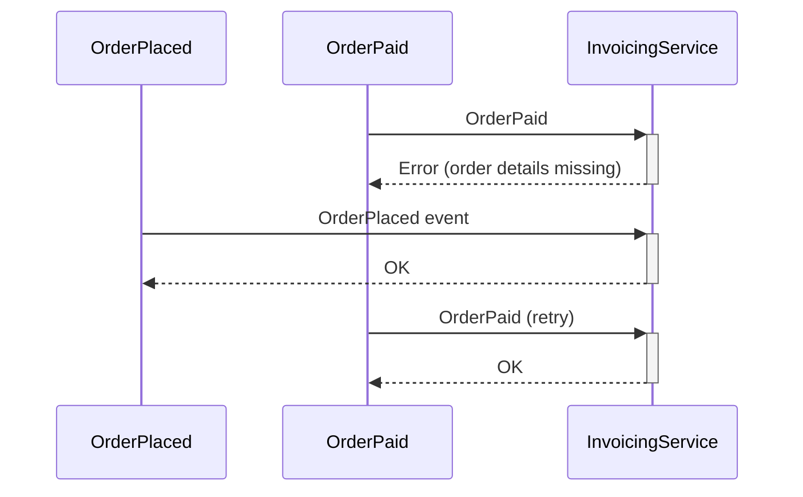
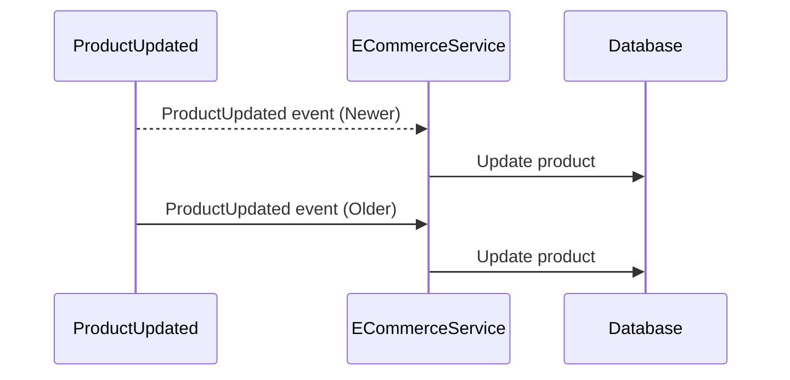
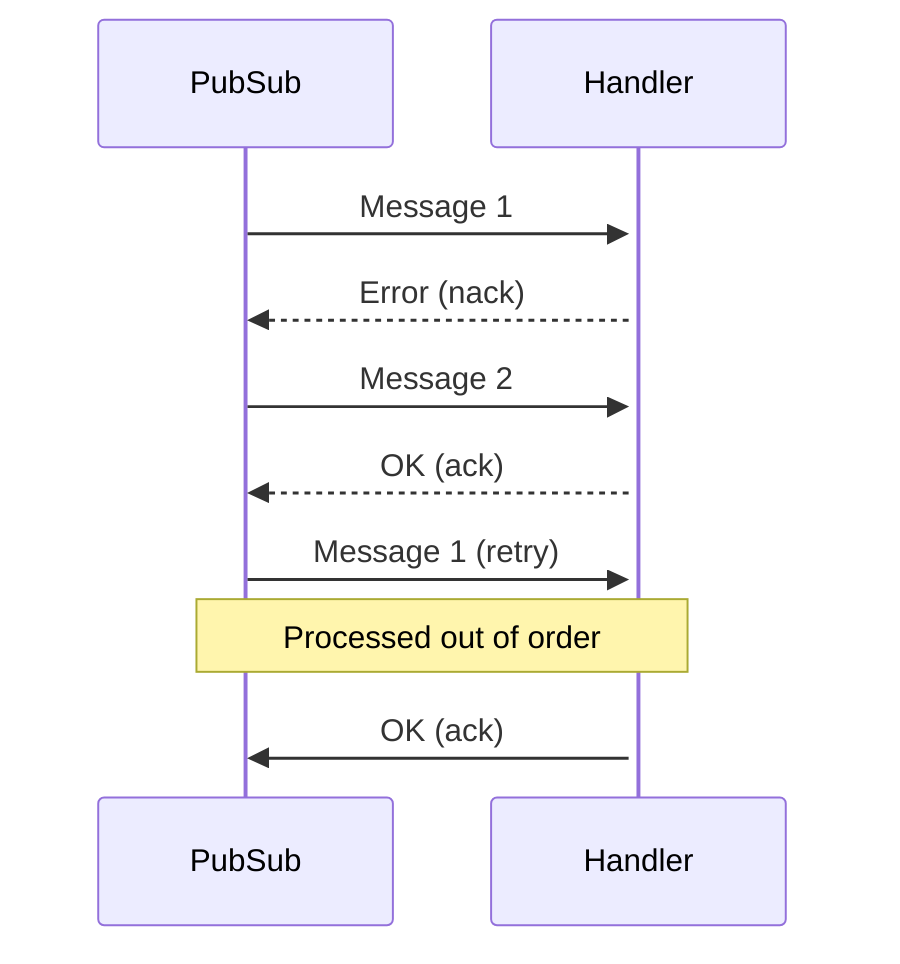

# Ordering

When you start using a Pub/Sub, you might expect that the messages will be processed in the order you publish them.
With trivial setups, this is generally true,
but the more complex your architecture becomes, the more likely it will be that messages are processed out of order.

In this module, we'll look at a few scenarios where messages can be delivered out of order and discuss what to do in those situations.

There are many factors that impact message ordering.
The right approach will depend on your system's design, the chosen Pub/Sub, and the configuration of your Pub/Sub.
We don't aim to cover all possible scenarios here.
Instead, we want to give you a mental model to think about message ordering that you can apply to your own systems.

## Why message ordering is that important
Message ordering is a trade-off between availability and consistency.
You can create a system where every message is processed sequentially, one after another, but this will significantly limit your system's throughput and availability.

The first limitation is throughput - you can't process more than one message at a time.
For example, if processing a single message takes 50ms, you can only process 20 messages per second.
But this isn't the biggest problem.

The real issue is availability.
If you process messages sequentially and receive a malformed message or have a bug in your code, it may block the processing of all other messages.

The other extreme is to have no order at all.
In this case, throughput won't be limited by how fast you can process a single message, and availability will be high because if one message fails, it won't block the processing of other messages.

In practice, it's good to be aware of these extreme approaches - usually you'll want to find a balance between the two.

## When message ordering is important

Consider a system with two events:

* `OrderPlaced`, which contains most of the order details
* `OrderPaid`, which confirms that the payment has been completed

There's an invoicing service that subscribes to both and issues an invoice after the order is paid.
If the service receives `OrderPaid` first, it will end with an error since the order details are missing.
However, that's not a big deal: 
The message will be retried, and if the `OrderPlaced` event eventually arrives, the system will handle it correctly.

Now consider a system with a `ProductUpdated` event.
The event contains all changes made to a product (like changing the price or description).
The e-commerce service subscribes to this event and updates the product in the database.

If the service receives the `ProductUpdated` events out of order, it will overwrite the changes made by the newer event.
In this case, the order of events can clearly be an issue.

## How can this happen?

The first reason is horizontal scaling.

Sooner or later, you will want to run multiple instances of your service to achieve high availability and increased throughput.
Messages may be delivered sequentially or in parallel to different service instances, depending on your Pub/Sub implementation or configuration.

{{tip}}

Every Pub/Sub has its own message ordering rules and guarantees.
**Understanding what ordering guarantees your chosen Pub/Sub implementation provides is critical when choosing Pub/Sub.**

{{endtip}}

In this scenario, messages can arrive almost at the same time, and one handler may process the message faster than the other.
In effect, the event that was sent later may be processed first.

{{tip}}

You might think that this is not a problem because your events are not published close to each other,
but this is usually a naive assumption.
Many things can happen in production that are hard to predict and can cause events to be delayed.
It's safer to assume that if something can happen, it will happen.

{{endtip}}

Even with a single handler running, the correct order of messages can be violated due to error handling.
If processing a message fails, and you retry it immediately by moving it to the head of the queue,
the order will be preserved. However, the message will keep being redelivered until it's processed successfully. 
That's rarely what you want because it will block the processing of other messages.

Most of the time, you would configure the Pub/Sub to retry the message after some time, or move it to the tail of the queue.
However in that case, the first message may be processed before the second one (after it's redelivered).

## How to deal with this situation?

As you can see, there are many factors you need to consider.
In the next few exercises, we'll look at some common scenarios and how to deal with them.
