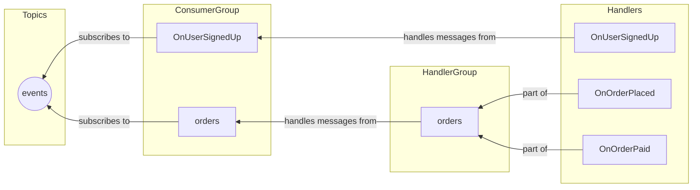

# Ordering: One Topic

You can't maintain message order across multiple topics.
To keep order of multiple events, you must use a single topic for all of them.

You also need a single {{exerciseLink "consumer group" "03-message-broker" "05-consumer-groups"}} and a single handler for all events in that topic.

The downside of this approach is that all handlers receive all events, even if they don't care about them, 
but in terms of ordering, it's the simplest approach.

The handlers need to filter out the events they care about.
One way to do that is to keep the event name in the message metadata.

Here's how to implement this with a raw message handler:

```go
router.AddConsumerHandler(
	"orders",
	"events",
	sub,
	func(msg *message.Message) error {
		eventName := msg.Metadata.Get("event_name")

		switch eventName {
		case "OrderPlaced":
			return handleOrderPlaced(msg)
		case "OrderPaid":
			return handleOrderPaid(msg)
		default:
			return nil
		}
	},
)
```

You need to subscribe to a single topic and dispatch messages to the appropriate handler based on event type.

A more convenient approach uses the `EventGroupProcessor` component, which works like `EventProcessor` but handles multiple event types in a single topic.

It works like in the example above: there's one handler for the chosen topic, which routes the messages to handlers based on the incoming event.



{{tip}}

If you need a refresher on how consumer groups work, check out {{exerciseLink "the consumer groups exercise" "03-message-broker" "05-consumer-groups"}}.

{{endtip}}

Usually, you will have multiple handler groups for a single topic. You may receive events that you don't want to handle. Set the `AckOnUnknownEvent` option to `true` to make the processor ack all messages that don't have a handler. This works like the `default` switch case in the example above.

```go
eventProcessor, err := cqrs.NewEventGroupProcessorWithConfig(
	router
	cqrs.EventGroupProcessorConfig{
		GenerateSubscribeTopic: func(params cqrs.EventGroupProcessorGenerateSubscribeTopicParams) (string, error) {
			return "events", nil
		}, 
		SubscriberConstructor: func(params cqrs.EventGroupProcessorSubscriberConstructorParams) (message.Subscriber, error) {
			// Don't forget to set up consumer groups here!
			// Use params.EventGroupName for the group name.
			return sub, nil
		}, 
		AckOnUnknownEvent: true, 
		Marshaler:         cqrs.JSONMarshaler{}, 
		Logger:            logger,
	},
)

eventProcessor.AddHandlersGroup(
	"orders", 
	cqrs.NewGroupEventHandler(func(ctx context.Context, event *OrderPlaced) error {
		return handleOrderPlaced(event)
	}), 
	cqrs.NewGroupEventHandler(func(ctx context.Context, event *OrderPaid) error {
		return handleOrderPaid(event)
	}),
)
```

## Exercise

Exercise path: ./14-message-ordering/02-one-topic/main.go

While Redis has served us well until now, it doesn't have mechanisms that can help us with message ordering.
For example, it [doesn't guarantee the order if there's more than one subscriber in a consumer group](https://redis.io/docs/latest/develop/data-types/streams/#differences-with-kafka-tm-partitions).
In this module, we'll use Apache Kafka as the message broker.

The publisher configuration is already set up in the `main.go` file.
As you can see, it's very similar to the Redis configuration.
From Watermill's perspective, it's just a matter of using a different `Publisher` and `Subscriber`.

The subscriber part can look very similar:

```go
sub, err := kafka.NewSubscriber(kafka.SubscriberConfig{
	Brokers:     []string{kafkaAddr}, 
	Unmarshaler: kafka.DefaultMarshaler{}, 
	// Make sure to use this config: it lets us validate your solution! 
	OverwriteSaramaConfig: newConfig(),
}, logger)

```

In this exercise, there are two events: `PlayerJoined` and `PlayerLeft`.
The game handler keeps track of the players and, upon each event, publishes the 
`GameUpdated` event with the current list of players.
All events are published on the `events` topic.

If events come out of order, a player might be removed before joining (because the handler is idempotent).
Then, when the `PlayerJoin` event is processed, the player will be added again and never removed.

Two parts of the code (marked with a `TODO`) are missing:

1. The `EventProcessor` config.
2. The `AddHandlersGroup()` arguments.

Fill them in so that:

* The service is subscribed to the `events` topic.
* There is one group subscribed to both events — use the `gameHandler.HandlePlayerJoined` and `gameHandler.HandlePlayerLeft` handlers.

3. In the subscriber constructor, create a new one with a proper consumer group set up.
