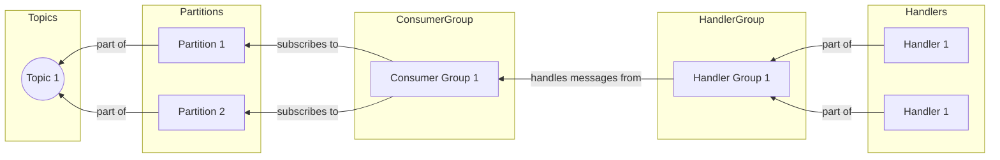
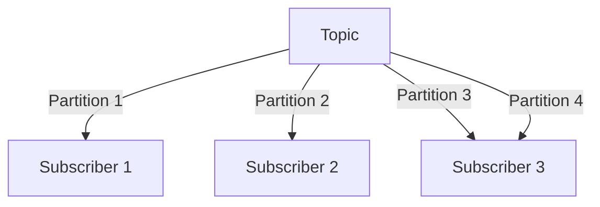

# Ordering: Partition per Entity

A downside of the single-topic approach is that all handlers receive all events, even if they don't care about them.
We can improve this by using a separate topic for each entity.

An "entity" in this context means a group of related events that concern the same model or business concept.
For example, we could have an `events.orders` topic for all events related to orders.

This is still not ideal, though.
First of all, a single failed event can stop updates for all other entities.
For example, if one `OrderPaid` event fails, all subsequent orders must wait until it's correctly handled.

The second issue is that we can't easily scale the processing of events.
Since the handlers don't know which entity the event belongs to, they can process only one message at a time if we want to keep things in order.

We can improve this approach by using partitions.

## Partitioning

Some Pub/Subs support explicit metadata for messages that makes it possible to scale processing them while keeping them in order.
This can be called an ordering key, partition key, or something similar.

In this example, we'll look at Kafka's partitions.
A partition is a way to split a topic into multiple queues.
Each partition is a separate queue, and Kafka guarantees that the messages within a partition will be delivered in order.



The number of partitions is set when the topic is created.
If there are not enough subscribers to consume all partitions, some subscribers will receive messages from multiple partitions.
If there are more subscribers than partitions, some subscribers will be idle.



The key point is that one partition is always assigned to one subscriber.
We want to have orders from a single entity always processed by one subscriber at a time (no parallel processing).
This means we can add more subscribers and not worry about messages being delivered out of order.

The crucial step is to set a **partition key** for each message: a string that uniquely identifies the entity (for example, the order ID).
Kafka uses a hashing algorithm to determine which partition the message should go to.

In watermill-kafka, you can set the partition key using a dedicated `marshaler`:

```go
pub, err := kafka.NewPublisher(kafka.PublisherConfig{
	Brokers: []string{kafkaAddr}, 
	Marshaler: kafka.NewWithPartitioningMarshaler(func(topic string, msg *message.Message) (string, error) {
		return msg.Metadata.Get("entity_id"), nil
	}),
}, logger)
```

## Exercise

Exercise path: ./14-message-ordering/03-partition-per-entity/main.go

This exercise is similar to the previous one. 
We'll tackle the same problem but using partitions.

Notice that we now create multiple partitions when creating the topic, thanks to the configuration:

```go
sub, err := kafka.NewSubscriber(kafka.SubscriberConfig{
	Brokers:                []string{kafkaAddr}, 
	Unmarshaler:            kafka.DefaultMarshaler{}, 
	ConsumerGroup:          params.EventGroupName, 
	InitializeTopicDetails: &sarama.TopicDetail{NumPartitions: 2, ReplicationFactor: 1},
}, logger)
```

**Fill in the marshaler (marked with `TODO`), so the partition key is set to the `player_id` metadata field.**
