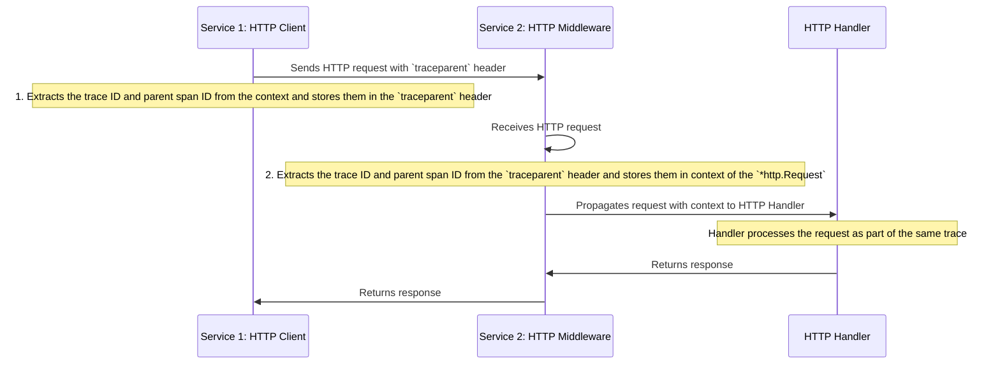
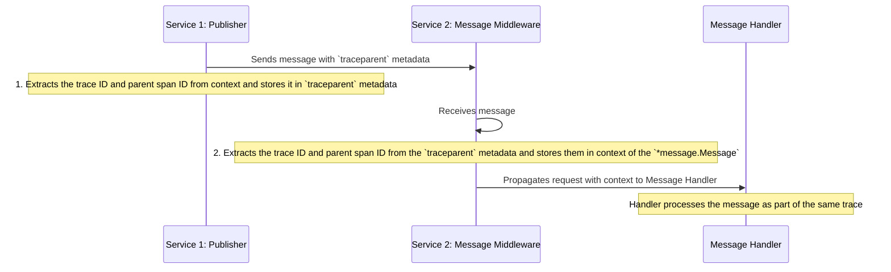

## Tracing Pub/Sub

Tracing within service boundaries is simple.
But the whole point of tracing is to understand the flow of the entire system, so we also need to trace communication between services.

In earlier examples, we used `context.Context` as transport for our traces.
Context is not serializable and is not propagated between services.
Once we make an HTTP/gRPC/event call, we lose track of the trace — we're not able to correlate them.

There are multiple standards that can be used for propagating traces.
We'll use the [W3C Trace Context](https://www.w3.org/TR/trace-context/) specification, which is the one recommended by OpenTelemetry.

{{tip}}

Older applications may use the Zipkin B3 format to propagate traces between services.
If you already have tracing in your system, and it does use the B3 format, you can use [the B3 propagator](https://pkg.go.dev/go.opentelemetry.io/contrib/propagators/b3).

{{endtip}}

To propagate a trace, we need to serialize the trace ID and parent span ID and pass them to the next service.

The _Trace Context_ standard defines a format that generates values, like: `00-0af7651916cd43dd8448eb211c80319c-b7ad6b7169203331-01`.
Later, this value is stored in the request header or message metadata with the name `traceparent`.

When the message or request is handled, the value is extracted from the header and deserialized.
Then, a new span is created with the same trace ID and parent span ID.

## Propagating traces

Tracing HTTP requests is beyond the scope of this training (we're not doing internal HTTP calls anyway).
However, it may be easier to explain how this should work at a high level using an example of an HTTP request.

To propagate an HTTP request, you need to update two places in your system:

1. Where you send requests (_HTTP client_): Extract the trace ID and parent span ID from the context and store them in the header as `traceparent`.
2. Where you receive requests (_HTTP middleware_): Extract the trace ID and parent span ID from the `traceparent` header and store them in the context of the `*http.Request` (so the handler can use it).



In event-driven systems, it works in a very similar way. 
You need to replace _HTTP client_ with _Publisher_ and _HTTP middleware_ with _Message handler middleware_:

1. Where you publish messages (_Publisher_): Extract the trace ID and parent span ID from the context and store them in the message's `traceparent` metadata.
2. Where you receive messages (_Message router middleware_): Extract the trace ID and parent span ID from the `traceparent` message metadata and store them in the context of the `*message.Message` (so the handler can use it).



Propagating traces is very similar to {{exerciseLink "propagating a correlation ID" "06-middlewares" "03-project-correlation-id"}}.

{{tip}}

In this exercise, we'll focus just on propagating traces with messages.
That's because messages are our only way of communicating: All HTTP calls are external, so we cannot propagate traces.

You can read more about tracing HTTP requests here: [pkg.go.dev/go.opentelemetry.io](https://pkg.go.dev/go.opentelemetry.io/contrib/instrumentation/net/http/httptrace/otelhttptrace).

{{endtip}}

Let's practice propagating traces with messages.

## Exercise

Exercise path: ./19-tracing/03-propagating-tracing-in-message/main.go

Add tracing to the example code.

1. Implement the {{exerciseLink "publisher decorator" "09-cqrs-events" "03-handling-correlation-id"}}.

In the decorator, add the `traceparent` metadata to the message.
You need to loop over messages and call this for each of them:

```go
otel.GetTextMapPropagator().Inject(messages[i].Context(), propagation.MapCarrier(messages[i].Metadata))
```

This serializes the trace ID and parent span ID and stores them in the message's metadata.

2. Implement the {{exerciseLink "message middleware" "06-middlewares" "01-add-middleware"}}.

* Extract the trace ID and parent span ID from the `traceparent` metadata and store them in the context of the `*message.Message`.

You can do this with:

```go
ctx = otel.GetTextMapPropagator().Extract(ctx, propagation.MapCarrier(msg.Metadata))
```

* Start a new span with the name `fmt.Sprintf("topic: %s, handler: %s", topic, handler)` and attributes `topic` and `handler`.
   (You should know how to extract them from {{exerciseLink "previous exercises" "18-metrics-and-alerting" "03-project-message-processing-metrics"}}.)

* Store the new context in the message context with `msg.SetContext(ctx)`, so the message handler will be part of the same trace.
* Add error information to your trace, like in the {{exerciseLink "previous exercise" "19-tracing" "02-tracing-attributes"}}.
* Configure the propagator to use W3C Trace Context format: in the `initTracing` function.

**Don't forget to add it; by default, the trace propagator is disabled and won't propagate traces.**

```go
otel.SetTextMapPropagator(propagation.TraceContext{})
```

**You need to be very careful to pass the correct context everywhere.** If you pass `context.Background()` instead of the proper one, the trace won't be correctly connected.

{{tip}}

Remember the proper order for middleware.

If you use a middleware that creates a span before the tracing middleware, it won't be connected with the trace (because it hasn't been parsed yet).

{{endtip}}
