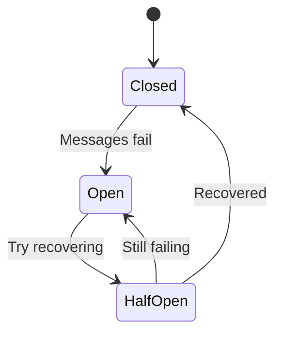

# Circuit Breaker

Throttling is usually good enough for scenarios with small spikes of messages.
If something goes truly wrong, however, you may end up with a huge queue of unprocessed messages.
For example, subscribers could be offline for some time.
Once they come back online, they'll have to process all the messages.

It's a common scenario for large amounts of traffic on the subscribers to cause another resource to fail,
like a database that can't handle the load. This makes things worse because the errors cascade and can impact other systems.

A circuit breaker is a mechanism that prevents the system from failing completely.
Once it detects a failing resource, it stops processing, so the resource can recover.

The purpose is similar to that of throttling, but throttling is a preventive measure that works well when you know the limits beforehand.
A circuit breaker reacts to failures as they happen, whatever caused them.

## Implementation

The circuit breaker implementation for message processing would be a state machine with three states:

* `closed`: Allows messages to be processed normally
* `open`: Rejects all incoming messages right away
* `half-open`: Allows a limited number of messages to be processed

The circuit breaker starts in the `closed` state.
After a configured number of fails, it moves to the `open` state, not allowing any messages to be processed.

After a configured time, it moves to the `half-open` state, allowing a limited number of messages to be processed.
If the messages keep failing, it moves back to the `open` state; if they succeed, it moves to the `closed` state instead.



Watermill provides circuit breaker middleware that uses the [`gobreaker`](https://github.com/sony/gobreaker) library.

```go
middleware.NewCircuitBreaker(gobreaker.Settings{
	// Settings
})
```

The default settings will stop processing messages for 60 seconds after five consecutive failures.
Then it will try to process one message and decide what to do next based on the outcome.

When the circuit breaker fails early, the message is nacked and returned back to the queue.
This can cause a load on the Pub/Sub side, but it should be more resilient than the external resource.
Note that for training purposes, we use a single Docker container with the Pub/Sub.
In production, you'd usually run a highly available cluster of several instances.

## Exercise

Exercise path: ./20-fault-tolerance/03-circuit-breaker/main.go

This exercise features a similar system to the previous one.
We migrated from the third-party SMS provider to our internal SMS-sending API.
We no longer need to throttle messages as there are no API limits.

We still have occasional issues with the API.
When it goes down, pending messages queue up.
Once the API comes up, it's flooded with messages, and sometimes the load
is big enough to break it again.
It's then stuck in a never-ending restart loop.

Use the circuit breaker middleware to avoid this issue.

For this exercise, you don't need to tweak much. Set the `Timeout` field to one second for testing purposes (down from the default 60).

Remember to pass the `.Middleware` method to the router's `AddMiddleware`, not the struct itself!
