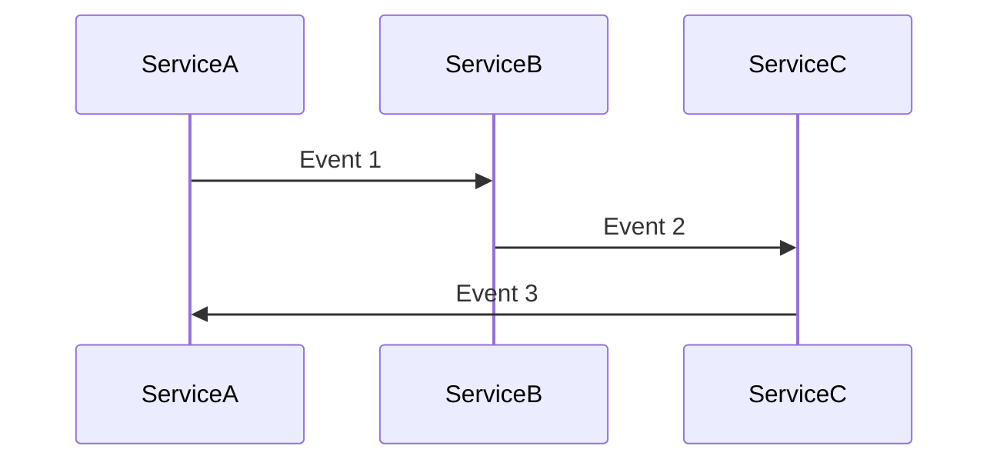
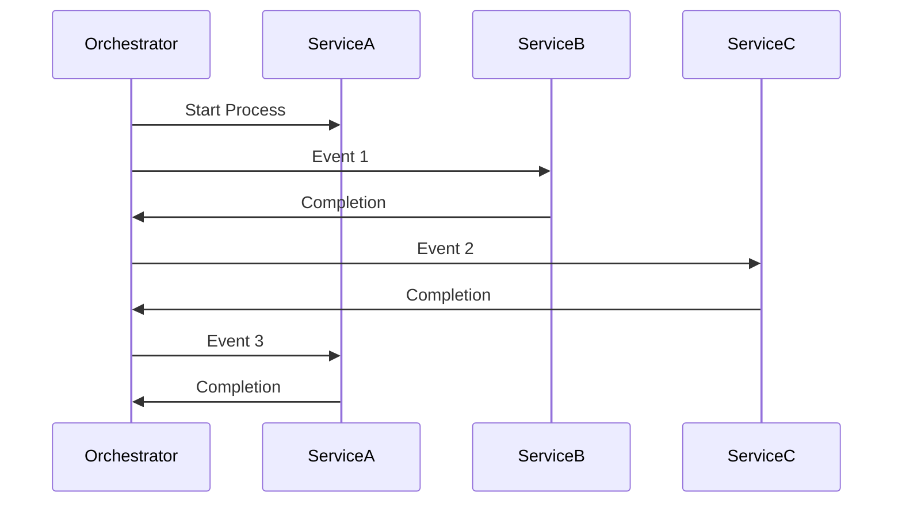

# Sagas and Process Managers

It's time to learn the patterns many people want to learn: sagas and process managers.
These patterns are often not properly understood and may be misused.
Using sagas and process managers incorrectly can create significant accidental complexity.

## Sagas vs. Process Managers

Both sagas and process managers handle long-running processes.
Multiple services are often involved.
They support automatic failure handling by rolling back each step when something goes wrong.
These operations are called _distributed transactions_.
Since they are distributed, they can't guarantee atomicity at the database level.

**In practice, the biggest difference between a saga and a process manager is that a saga is stateless while a process manager is stateful.**

Formal definitions alone may not explain how these patterns work.
Let's see how this works in real-life scenarios.

## Orchestration vs. Choreography

Currently, in our service, tickets are coordinated using _choreography_.
This means there is no central point that coordinates the whole process.

Generally, choreography looks like this:

For complex processes, an orchestrator coordinates the whole process.
This is especially true across multiple services and teams.
Example orchestration looks like this:

Orchestration adds significant overhead. Use it only when complexity justifies this cost.

Sagas and process managers are used as orchestrators.

Usually, coordination by a saga / process manager is done via commands based on events that arrive.
Sagas / process managers don't need to know who is handling those commands later.
It can even be a different service.

If there is no need for a supporting compensation (rollback) and the process is simple, it's a good idea to start with choreography.
When the process becomes more complex, it's a good idea to move to orchestration with sagas or process managers.

### Compensating Actions

Distributed transactions can fail, just like SQL transactions.
You must prepare compensation for actions that were already completed.

In databases, doing rollbacks is simple. You start the transaction, and if some precondition fails, the database handles the rollback.

Distributed transactions are different. You need to implement compensating operations by hand.

For example, imagine we are selling tickets for a show with a flight ticket. We start by buying a show ticket and later a flight ticket. If buying the flight ticket fails, we need to cancel the show ticket.

This isn't a big deal for such a simple scenario. However, it can become very complex when there are many steps in the process.

Like in databases, it's possible to accidentally end up with a deadlock. Because of this, it's crucial to have proper alerting and tests in place. You should also devote extra effort to building a model of them.

{{tip}}

Compensating actions are harder with multiple parallel operations. 
We recommend avoiding parallel flows within one saga / process manager.
Avoid sending multiple commands at the same time if not required.
This will simplify your life. Emit and handle command results one by one.
Handling compensation becomes much easier this way. You don't need to know which commands to wait for before compensating.

{{endtip}}

## When to **Not** Use Sagas / Process Managers

Mentioning all the complexities of distributed transactions may be scary. 
That's not without a good reason: This is not a pattern that should be used everywhere. 
In many cases, this pattern is misused in places where the transaction doesn't need to be distributed.
One of the most common cases is incorrect and too granular services separation.

Here's the root cause of that problem:

{{img "More microservices" "more-microservices.jpg"}}

Very often, operations that could be done within a single SQL transaction are split into multiple microservices for no good reason.
This can lead to extreme situations where there are more microservices than people in the team!

Unfortunately, it's not for free. 
Sagas and process managers are excellent tools for masking that problem (and make it even worse). 
The price is complex code that is harder to debug and extend.

Before using a saga or process manager, ask yourself: _"Can't it be one entity within one service? If no, why?"_.
Remember: the biggest benefit of microservices is organizational scalability. 
They solve the problem of scaling the team.
If you have too many people committing into one repository, you may need to split it into multiple services.
**We have seen more cases and complexity generated from too granular service splitting rather than too large services.**

Simply combining two entities into one and putting them into one service may be enough to solve the problem.

{{tip}}

The Aggregate Pattern and Bounded Contexts from DDD help avoid unnecessary distributed transactions.

We plan to release articles about them on our blog this year. 
If you're not subscribed to our newsletter yet, you can sign up [here](https://threedots.tech/newsletter/).

{{endtip}}

## When to Use Sagas / Process Managers

If sagas / process managers have so many potential complexities, why are we even talking about them?

There are two cases when sagas / process managers are very useful:

1. When transactions need to be distributed (for example, requiring external system calls) and you need to coordinate multiple actions and compensate them if one of them fails.
2. When an entity or process is too complex and should be decoupled into multiple services.

While in first case, it's evident that sagas / process managers are needed, in the second case, there is no simple answer
as to whether it's needed or not. It's all about choosing the right set of tradeoffs.

The best way to get a good perspective for when those patterns are a good fit is to practice.

## Observability

Proper {{exerciseLink "tracing" "19-tracing" "01-tracing"}} and {{exerciseLink "metrics" "18-metrics-and-alerting" "05-alerts"}} are crucial for production-grade sagas / process managers.
All patterns from previous modules apply here too.
You need clear visibility into how processes work and when they fail.

## Let's Practice a Bit

We have some basic knowledge about sagas / process managers, so it's time to practice a bit.
Don't worry if everything is not clear yet — you can go back to this module later to refresh your knowledge
during implementation.
