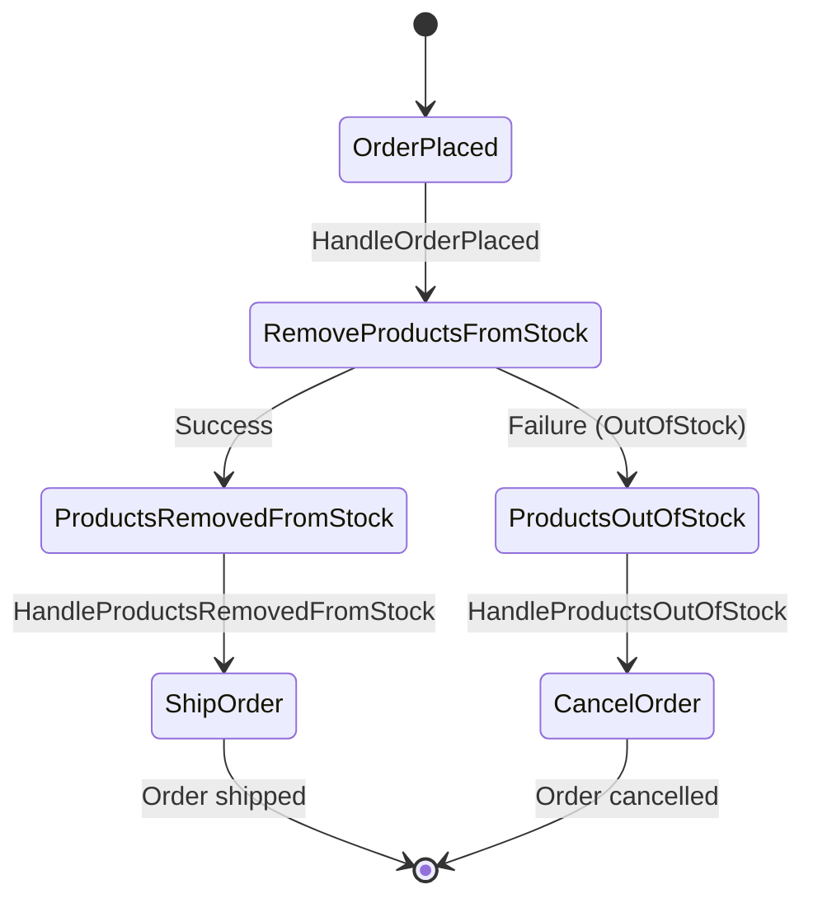
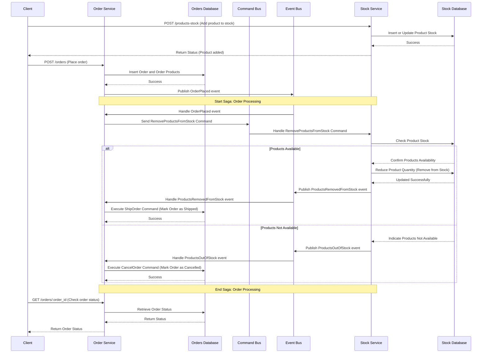
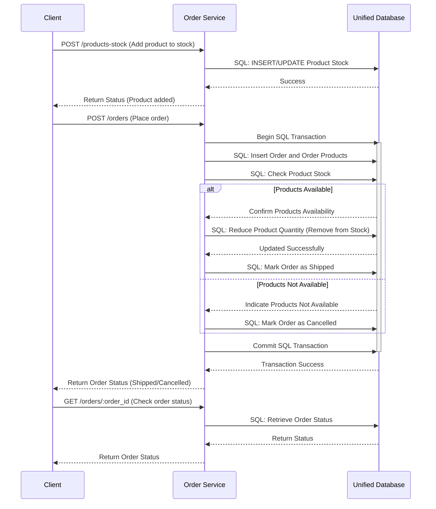

# Removing Sagas

When you saw this title, your reaction was probably something like: "What? Why?".
As mentioned earlier, the saga pattern is a very powerful tool, but it's also very dangerous.
Have you ever heard the expression that if you have a hammer, everything looks like a nail?
We want to avoid that situation. Before we give you this hammer, we'll provide you with a bit of safety training.

We have prepared an example where we misused a saga, and your task is to remove it.
You can also learn how the saga is implemented in that way.

In this exercise, the code shows an example that is very often used as an illustration of the saga pattern.
This is an example where we are implementing a simple shop.
We have two microservices: `Order` and `Stock`.
Order is responsible for handling orders, and Stock is responsible for keeping track of products in stock.
When an order is placed, we need to remove products from stock.
If there are not enough products in stock, we need to cancel the order.



This looks very simple in a state diagram. 
We have Orders and Stock, so it sounds like a good idea to split it into two microservices, right?
Actually is a terrible idea for a simple shop.
**At least, as long as you are not building a very complex e-commerce platform with dozens of developers and multiple teams working on it.**

{{img "More microservices" "more-microservices.jpg"}}

The amount of accidental complexity is visible in a sequence diagram:



It's much worse, isn't it? And those are just two services that are responsible for handling orders.
You can imagine what would happen if we added more services to the mix.

You may wonder if there is any way of avoiding that complexity.
If anyone or any framework is promising you that it's possible, they are either lying, or they don't know what they are talking about.
The only thing that any library or framework can give you is glue that you can use to connect your actions.
You still need to implement your product-specific logic; no tool will save you from that.

But there is one thing that you can do to avoid this complexity -- remove the saga.

## Exercise

Exercise path: ./21-sagas-and-process-managers/02-removing-sagas/main.go

In this exercise, you will remove the saga from a project created for this exercise.
**Remove all Pub/Sub and saga code. Implement the logic within a single database transaction.**
The Pub/Sub won't be available during execution.

It's mostly about removing and moving code around (you should be able to remove around 500 lines of code!).

For simplicity, two services run within one process.
You can treat `orders` and `stock` modules as two separate services.
**Ideally, you should remove the `Stock` service. Do everything in `Orders` instead.**

**We want to keep the API backward compatible** — other teams already depend on it.
**The API will not be perfect, but it's the usual pain of bad design decisions we have to come to terms with.** 🥲

The API used to work like this:

1. Order has been placed.
2. Asynchronously, we check if products are in stock.
3. If yes, we mark the order as shipped.
4. If not, we mark it as canceled.

**We want to do it synchronously now. This way we can check if products are available during order creation.
We can create the order with `shipped` and `canceled` fields during the order creation.**

In other words:
1. If products are not in stock, create the order as `cancelled`.
2. If enough products are in stock, create the order as `shipped`.

{{tip}}

If we built this API from scratch without backward compatibility requirements, it could return `400 Bad Request` or `409 Conflict` when products are not in stock.
We won't do it now, as it would break the API contract.

{{endtip}}

Here's how your code should behave:



When porting from `stock`, check if the error is `ProductsOutOfStockError`.

```go
outOfStock := false

err := removeProductsFromStock(order.Products, tx)
var outOfStockError ProductsOutOfStockError
if errors.As(err, &outOfStockError) {
    outOfStock = true
} else if err != nil {
    return fmt.Errorf("failed to remove products from stock: %w", err)
}
```

Remember to run `removeProductsFromStock` before inserting to the `orders` table. This way you can set the `shipped` and `cancelled` fields correctly.

{{tip}}

We know that removing things you spent a lot of time implementing is hard in real life. Keep in mind that you may be affected by the [sunk cost fallacy](https://thedecisionlab.com/biases/the-sunk-cost-fallacy).

The fact that you invested a lot of time in something doesn't mean that you should continue to do so. Sometimes, it's better to admit that you made a mistake and change the direction.

On the other hand, removing someone else's code is fun, so enjoy removing our implementation! 😄

{{endtip}}

We prepared this example to make the migration fairly easy.
If you want step-by-step instructions, check the hints below.

If you feel you broke the initial implementation, reset the exercise code by running `tdl tr reset-exercise`.

{{hints}}

{{hint 1}}

1. Ensure you understand how the current API contract works.

Tests for this exercise are public in the `tests` package. Check them to understand the expected behavior.

2. Move the database schema from `stock/db.go` to `orders/db.go` (`initializeDatabaseSchema` function).
3. Move the database functions from `stock/db.go` to the `orders` service.
4. Migrate `POST /products-stock` endpoint to the `orders` service.
5. Move logic of removing items from stock from `stock/messages.go` to the `orders` service.

Call `removeProductsFromStock` as part of `addOrder`'s transaction in `orders/db.go`.
`removeProductsFromStock` checks if products are available in stock. If not, it returns `ProductsOutOfStockError`.

**You must catch this error (don't return it)**. Based on this error, decide if the order should be created as `shipped` or `cancelled`.

```go
// TODO: use outOfStock when inserting to `orders` table
outOfStock := false

err := removeProductsFromStock(order.Products, tx)
var outOfStockError ProductsOutOfStockError
if errors.As(err, &outOfStockError) {
    outOfStock = true
} else if err != nil {
    return fmt.Errorf("failed to remove products from stock: %w", err)
}
```

Remember: **you no longer need to publish any events or commands**. We'll do everything within a single transaction.

6. We immediately know if we can ship the order. Mark the order as shipped right away.
7. Remove all saga, commands, events, and message-related code.
8. Remove the `stock` service.

{{endhint}}

{{endhints}}
