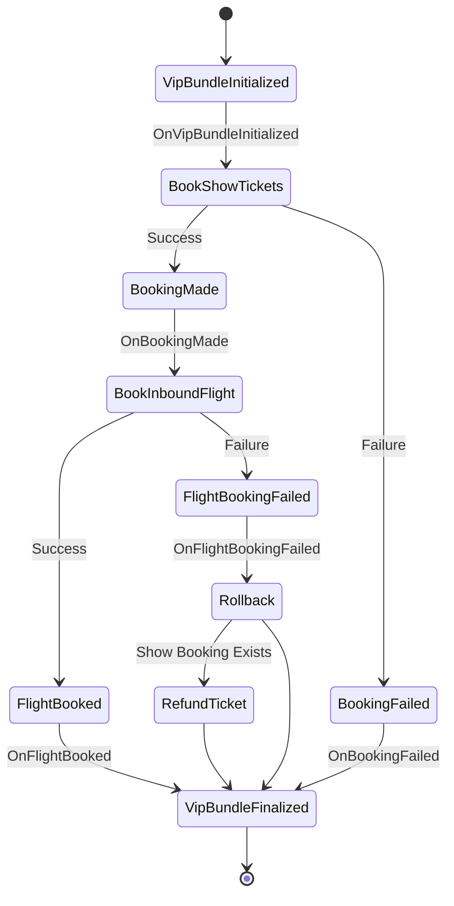

# Handling flight booking failure

If booking inbound flight fails, we should cancel all show tickets.

## Exercise

Exercise path: ./project-modeling-process-manager

1. Add a new event handler for `TicketBookingConfirmed_v1`. Store all booked ticket IDs from this event in the `VipBundle` (process manager state).
   You'll need these to know which tickets to refund.

`TicketBookingConfirmed_v1` has this structure:

```go
type TicketBookingConfirmed_v1 struct {
	Header MessageHeader `json:"header"`

	TicketID      string `json:"ticket_id"`
	CustomerEmail string `json:"customer_email"`
	Price         Money  `json:"price"`

	BookingID string `json:"booking_id"`
}
```

Think of the process manager state as a form of {{exerciseLink "read model" "13-read-models" "01-read-models"}}.
It's eventually consistent. This matters for events that arrive with delays.

2. If you receive `BookingFailed_v1` or `OnFlightBookingFailed`, cancel show tickets.
Send the `RefundTicket` command for each ticket received in `TicketBookingConfirmed_v1` and saved in the `VipBundle`.

To emit `RefundTicket`, you need to ensure all `TicketBookingConfirmed_v1` events were processed. You know how many tickets to expect based on `VipBundle.NumberOfTickets`.
If you didn't receive all of them, return an error instead of emitting `RefundTicket` command.

`RefundTickets` command has this structure:

```go
type RefundTicket struct {
	Header MessageHeader `json:"header"`

	TicketID string `json:"ticket_id"`
}
```

`FlightBookingFailed_v1` has the following structure:

```go
type FlightBookingFailed_v1 struct {
	Header MessageHeader `json:"header"`

	FlightID      uuid.UUID `json:"flight_id"`
	FailureReason string    `json:"failure_reason"`

	ReferenceID string `json:"reference_id"`
}
```

**We still work on the `VipBundleProcessManager`. Our goal is to emit the command without implementing its handler yet.**



{{hints}}

{{hint 1}}

Make sure you don't try to refund tickets that have not been booked yet.

You can check if the `BookingMadeAt` is set.

{{endhint}}

{{endhints}}
