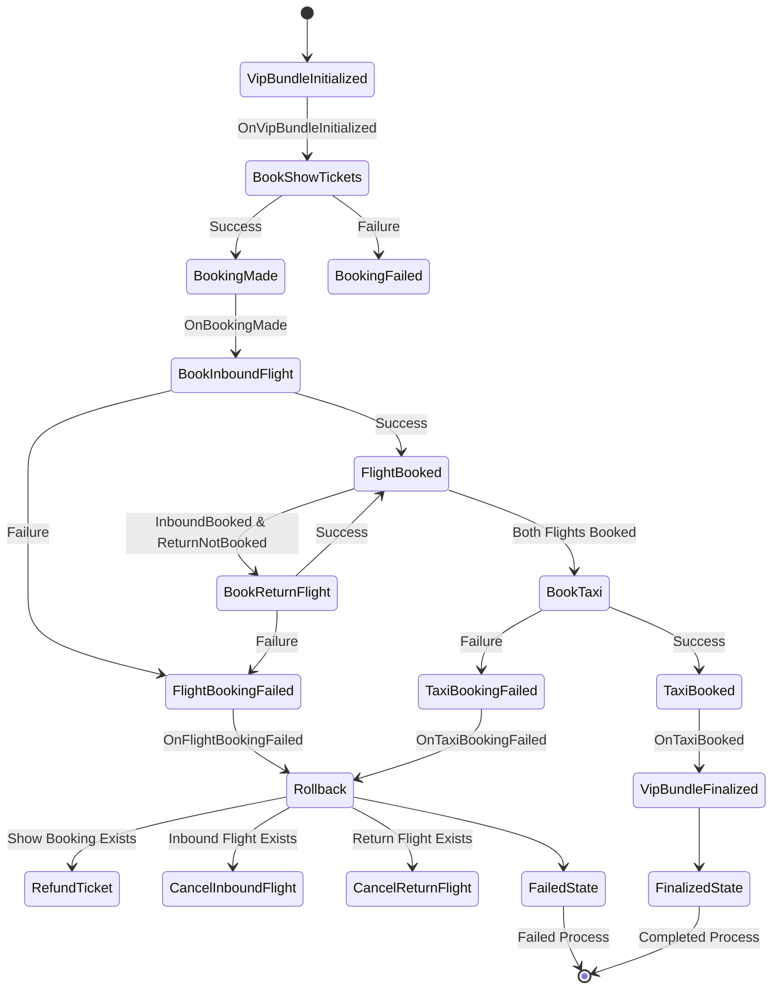

# Modeling Saga

In real life, process managers are rarely as simple as in the previous module.
In this module we'll build a process with complexity closer to real processes.

**Conceptually there is nothing new from the previous module. We are still storing data from events and emitting commands based on that data. That's why we made this module optional.**

Stay with us if you want to practice building more complex process managers.
If not, you can skip this module by hitting `s` in `tdl tr run` or running `tdl tr skip`.
No worries, you can always go back to this module later.

{{background}}

Our MVP VIP Bundle pilot was a great success.
After verifying the idea, we can now implement the full version of the VIP Bundle.

We want to add support for return flights and taxi bookings.

We want to deliver the entire VIP bundle experience. If we cannot book any taxi or flight, we should rollback the entire bundle.

If this becomes a problem, we may consider adding fallback taxi providers. But let's not overcomplicate it for now.

{{endbackground}}

Like previously, we'll start with modeling the process manager. We'll move the model to the project later.

The entire process manager will look like this at the end:



## Exercise

Exercise path: ./project-modeling-process-manager

**Implement the missing `VipBundleProcessManager` methods to make all tests pass.**

You need to support these new messages:

```go
type BookTaxi struct {
	CustomerEmail      string `json:"customer_email"`
	CustomerName       string `json:"customer_name"`
	NumberOfPassengers int    `json:"number_of_passengers"`
	ReferenceID        string `json:"reference_id"`
	IdempotencyKey     string `json:"idempotency_key"`
}

type CancelFlightTickets struct {
	FlightTicketIDs []uuid.UUID `json:"flight_ticket_id"`
}

type TaxiBooked_v1 struct {
	Header MessageHeader `json:"header"`

	TaxiBookingID uuid.UUID `json:"taxi_booking_id"`

	ReferenceID string `json:"reference_id"`
}

type TaxiBookingFailed_v1 struct {
	Header MessageHeader `json:"header"`

	FailureReason string `json:"failure_reason"`

	ReferenceID string `json:"reference_id"`
}

```
You need to add support for:

1. Booking return flight tickets after successfully booking inbound flight tickets. This happens after `OnFlightBooked` for inbound flight arrives.

When `VipBundle` is created, we will also receive the `ReturnFlightID` -- ID of the return flight.

{{tip}}

You need to distinguish between two flight types: inbound and return when handling `FlightBooked_v1` event.
Based on that, decide whether to book return flight or taxi.

{{endtip}}

2. Booking taxi
3. Canceling inbound and return flight tickets (`CancelFlightTickets` command) and show tickets when taxi booking fails

Store all information needed to cancel actions in the `VipBundle` entity.
Think of this as a form of {{exerciseLink "read model" "13-read-models" "01-read-models"}}.

Store `FlightID` from `FlightBooked_v1` in your process manager.

Taxi booking is the last operation. It will never be canceled as nothing later can break the flow.

4. Move emitting `VipBundleFinalized_v1` and setting `IsFinalized` to the last process manager step.

This is the last module. We will provide very little guidance.
You should already know how to do all steps.
