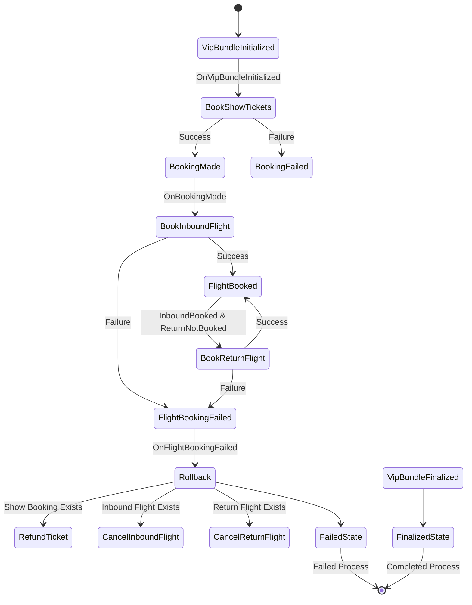

# Rollback of Show Tickets

It's time to use the main purpose of our process manager: handling rollbacks.

Let's start with refunding tickets when we fail to book an inbound flight ticket.
In this exercise, our process will fail when we try to book an inbound flight ticket. The API will return a `409 Conflict` status code.

You need to handle this error by emitting `FlightBookingFailed_v1`.

You already implemented the `RefundTicket` command handler in {{exerciseLink "12-cqrs-commands/03-project-handle-command" "12-cqrs-commands" "03-project-handle-command"}}.
Unless something broke, it should work out of the box. This command should be emitted by your process manager.



## Exercise

Exercise path: ./project

In the `BookFlight` command handler, emit `FlightBookingFailed_v1` if booking the flight fails with a `409 Conflict` status code.

How you implement this is up to you. One way to do this is to have a dedicated error for this case like:

```go
var ErrNoFlightTicketsAvailable = fmt.Errorf("no flight tickets available")
```

You can return this error when the API returns a `409 Conflict` status code. Then, in the command handler, you can check for this error and emit `FlightBookingFailed_v1`.

The process manager should already emit `RefundTicket` when `FlightBookingFailed_v1` is received.
You should already have the `RefundTicket` command handler implemented in {{exerciseLink "12-cqrs-commands/03-project-handle-command" "12-cqrs-commands" "03-project-handle-command"}}. 
There's nothing to implement here as long as it still works!

Once that's done, you should have the MVP of the process manager working.
