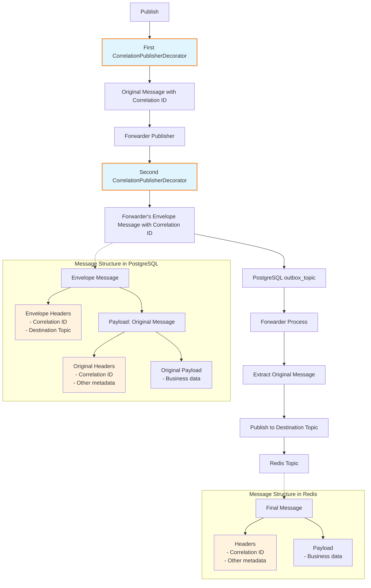

# Emitting BookingMade event

It's time to publish the `BookingMade` event!

## Exercise

Exercise path: ./project

Publish the `BookingMade` event during a call to the `POST /book-tickets` endpoint.
**It must be emitted in one transaction with the booking stored in the database.**

In the payload, you should include the following:

- Booking ID
- Number of tickets
- Customer email
- Show ID

You can use this Go structure as a starting point:

```go
type BookingMade struct {
    Header MessageHeader `json:"header"`

    NumberOfTickets int    `json:"number_of_tickets"`
    BookingID       string `json:"booking_id"`
    CustomerEmail   string `json:"customer_email"`
    ShowID          string `json:"show_id"`
}
```

1. Create an `EventBus` instance using the outbox publisher (like in the {{exerciseLink "previous exercise" "11-outbox" "08-publishing-events-with-forwarder"}}).

**It must be created per transaction,** so the constructors should be called for every transaction.

Remember to decorate the publisher with the forwarder, so it goes through the outbox (like in the {{exerciseLink "07-forwarding-with-outbox" "11-outbox" "07-forwarding-with-outbox"}}).
Use the `events_to_forward` topic in the configuration.

2. Publish the event with your `EventBus`.

{{tip}}

Many parts need to be configured properly to make this work.

If something breaks, logs are your friends!
If you can't figure out what's wrong, ask the Mentor or share your solution on Discord.
(Click the "Share your solution" button, choose the most recent one, and copy the link to the training Discord channel.)

{{endtip}}

{{hints}}

{{hint 1}}

You need to create a new instance of the `message.Publisher` (like in the {{exerciseLink "previous exercise" "11-outbox" "08-publishing-events-with-forwarder"}}).
In our project, we want to use it in the Event Bus instead of directly using the publisher.

```go
func (b BookingsRepository) AddBooking(ctx context.Context, booking entities.Booking) (err error) {
	return updateInTx(
		ctx,
		b.db,
		sql.LevelRepeatableRead,
		func(ctx context.Context, tx *sqlx.Tx) error {
            _, err = tx.NamedExecContext(ctx, `
				INSERT INTO 
					bookings (booking_id, show_id, number_of_tickets, customer_email) 
				VALUES (:booking_id, :show_id, :number_of_tickets, :customer_email)
		    `, booking)
			
			// ...

			outboxPublisher, err := outbox.NewPublisherForDb(ctx, tx)
			if err != nil {
				return fmt.Errorf("could not create event bus: %w", err)
			}

			bus := event.NewBus(outboxPublisher)

            // ...
		},
	)
}
```

It's useful to wrap database transactions in such functions:

```go
func updateInTx(
	ctx context.Context,
	db *sqlx.DB,
	isolation sql.IsolationLevel,
	fn func(ctx context.Context, tx *sqlx.Tx) error,
) (err error) {
	tx, err := db.BeginTxx(ctx, &sql.TxOptions{Isolation: isolation})
	if err != nil {
		return fmt.Errorf("could not begin transaction: %w", err)
	}

	defer func() {
		if err != nil {
			if rollbackErr := tx.Rollback(); rollbackErr != nil {
				err = errors.Join(err, rollbackErr)
			}
			return
		}

		err = tx.Commit()
	}()

	return fn(ctx, tx)
}
```

If anything fails, the transaction will be rolled back and no data will be stored in the database.


{{ endhint }}

{{hint 2}}

If you compare your solution with our diffs, you may notice that we decorate the publisher twice with `log.CorrelationPublisherDecorator`

```go
publisher, err := watermillSQL.NewPublisher(
	db,
	watermillSQL.PublisherConfig{
		SchemaAdapter: watermillSQL.DefaultPostgreSQLSchema{},
	},
	logger,
)
// ...
publisher = log.CorrelationPublisherDecorator{publisher}

publisher = forwarder.NewPublisher(publisher, forwarder.PublisherConfig{
	ForwarderTopic: outboxTopic,
})
publisher = log.CorrelationPublisherDecorator{publisher}
```

It's because we want to include correlation ID both in the envelope and the event that is published to the Redis later.



This way, the correlation ID is included in both the envelope and the event itself, which can be useful for tracing and debugging.
If you don't remember why we are enveloping messages, check the {{exerciseLink "08-publishing-events-with-forwarder" "11-outbox" "08-publishing-events-with-forwarder"}}.

{{endhint}}

{{endhints}}
